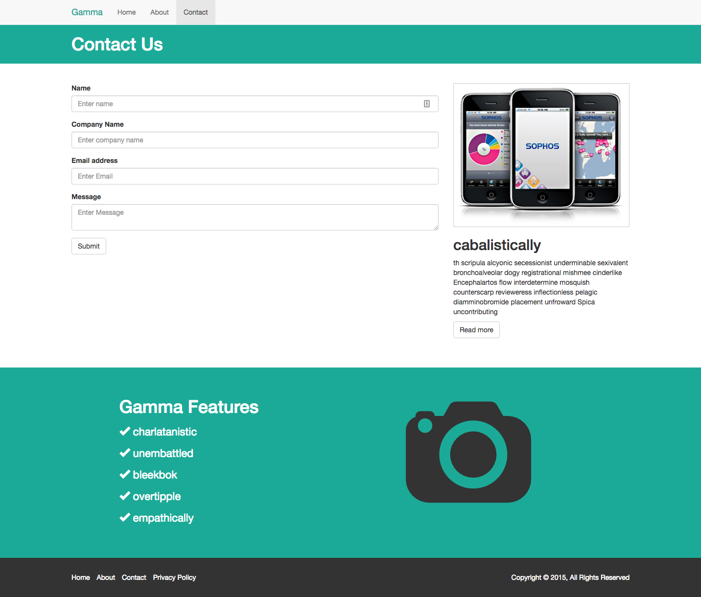

## PhotoApp Website

Create the following site w/ Bootstrap 
The images you'll need are available at `/material/resources.zip`

### Home Page 

### About Page 

### Contact Page 

You have more images of different versions (different resolutions) of these designs at the `resources` folder

## What you'll learn

- Build a basic but clean website
- Use bootstrap HTML/CSS components
- Create a showcase area with images and text
- Use the 12 column grid system

## Project Features

- Bootstrap navigation
- Jumbotron
- Accordion Menu
- Grid System
- Image Classes
- Button Classes
- Glyphicons
- Contact Form
- Footer
- REsponsive Media Queries